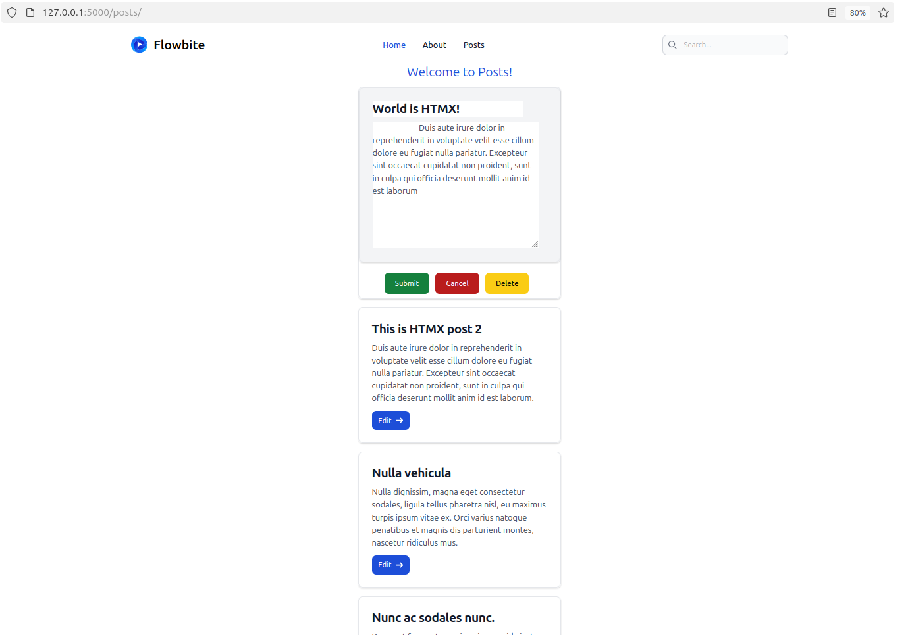

# Flask-HTMX-TW-css---
тест лента * 
## 🛠🛠🛠🛠🛠
# tailwind
+ https://flowbite.com/docs/getting-started/quickstart/
# htmx
+ https://htmx.org/docs/#installing
## Запуск проекта
+ venv -->
+ flask --app main run --debug
+ npx tailwindcss -i ./static/src/input.css -o ./static/dist/css/output.css --watch

## 🛠🛠🛠🛠🛠🛠

